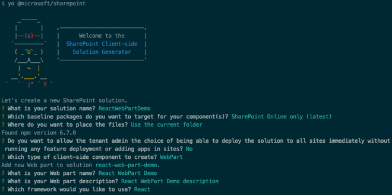

## Creating React Web Parts

In this demo you will create a SharePoint Framework client-side web part that leverages the React web framework.

1. Open a command prompt and change to the folder where you want to create the project.
1. Run the SharePoint Yeoman generator by executing the following command:

    ```shell
    yo @microsoft/sharepoint
    ```

    Use the following to complete the prompt that is displayed:

    - **What is your solution name?**: ReactWebPartDemo
    - **Which baseline packages do you want to target for your component(s)?**: SharePoint Online only (latest)
    - **Where do you want to place the files?**: Use the current folder
    - **Do you want to allow the tenant admin the choice of being able to deploy the solution to all sites immediately without running any feature deployment or adding apps in sites?**: No
    - **Which type of client-side component to create?**: WebPart
    - **What is your Web part name?**: React WebPart Demo
    - **What is your Web part description?**: React WebPart Demo description
    - **Which framework would you like to use?**: React

    

    After provisioning the folders required for the project, the generator will install all the dependency packages using NPM.

1. When NPM completes downloading all dependencies, run the project by executing the following command:

    ```shell
    gulp serve
    ```

1. The SharePoint Framework's gulp **serve** task will build the project, start a local web server and launch a browser open to the SharePoint Workbench:

    

1. Select the web part icon button to open the list of available web parts:

    

1. Select the **HelloWorld** web part:

    

### Examine the Web Part code

Before modifying the web part code, take a minute to see how this project differs from a SPFx project that does not utilize React.

1. Open the **package.json** file in the root of the project

    Notice the presence of a few extra packages in the `dependencies` section. The `react` & `react-dom` packages contain the core React web framework and the bridge between React & the DOM while `@types/react` & `@types/react-dom` contain the TypeScript type declarations for the libraries.

1. Open the web part in the **./src/webparts/reactWebPartDemo/ReactWebPartDemoWebPart.ts** file.

    Notice the main difference in this web part from one that does not leverage the React Framework is in the `render()` method. Instead of writing HTML out, it first creates a new React component and then uses the `ReactDom.render()` method to render the component into the `div` for the web part.

    The React component that is created is the **ReactWebPartDemo**.

1. Open the React component: **./src/webparts/reactWebPartDemo/components/ReactWebPartDemo.tsx**.

    This file contains a class declaration that extents the base `React.Component` abstract class. It contains a single method, `render()`, that serves the same purpose as the `render()` method in the web part: it renders the control out.

    Because we are using the TypeScript Extended (***.tsx**) language and syntax, well-formed HTML can be directly returned to the caller. The caller is the React web framework.

    This component has a single public property: `description`. This is defined as an interface in the **./src/webparts/reactWebPartDemo/components/IReactWebPartDemoProps.ts** file.

Now that you understand how a React project is structured, add some data and a child component to the web part.

### Update the web part code

Update the web part to show a list of colors using a child React component.

1. Create a new file in the **./src/webparts/reactWebPartDemo** folder named **IColor.ts**.

    Add the following code to the file. This will act as an interface to our new object type:

    ```ts
    export interface IColor {
      id: number;
      title: string;
    }
    ```

1. Create a new React component that will show a list of colors provided to it as a public property:

    1. Create a new file **ColorList.tsx** in the **./src/webparts/reactWebPartDemo/components**.
    1. Add the following code to the **ColorList.tsx** file. This creates an public interface for the component's public signature and creates the core React component:

        ```ts
        import * as React from 'react';
        import { IColor } from '../IColor';

        export interface IColorListProps {
          colors: IColor[];
        }

        export class ColorList extends React.Component<IColorListProps, {}> {
          public render(): React.ReactElement<IColorListProps> {
            return ();
          }
        }
        ```

    1. Update the `render()` method in the `ColorList` component with the following. This will write out an unordered list of colors that have been provided as a property when the component is added to the page:

        ```tsx
        public render(): React.ReactElement<IColorListProps> {
          return (
            <ul>
              {
                this.props.colors.map(colorItem => (
                  <li>{ colorItem.title }</li>
                ))
              }
            </ul>
          );
        }
        ```

1. With a React component created that will display a list of colors, the next step is to use it. Do this by updating the default React component created by the SPFx Yeoman generator:
    1. Open the **./src/webparts/reactWebPartDemo/components/ReactWebPartDemo.tsx** file.
    1. Add the following `import` statements after the existing `import` statements. These will add references to the new files and objects you previously created:

        ```ts
        import { IColor } from "../IColor";
        import { ColorList, IColorListProps } from "./ColorList";
        ```

    1. Add a new private member to the `ReactWebPartDemo` class that contains a static collection of colors:

        ```ts
        private _colors: IColor[] = [
          { id: 1, title: 'red' },
          { id: 2, title: 'blue' },
          { id: 3, title: 'green' }
        ];
        ```

    1. Next, update the `ReactWebPartDemo`'s `render()` method to use the new React component you previously created. The only important line here is the `<ColorList>` component reference.

        Notice the `colors` public property on the component is bound to the private array of colors you created above:

        ```tsx
        public render(): React.ReactElement<IReactWebPartDemoProps> {
          return (
            <div className={ styles.reactWebPartDemo }>
              <div className={ styles.container }>
                <div className={ styles.row }>
                  <div className={ styles.column }>
                    <span className={ styles.title }>Welcome to SharePoint + React!</span>
                    <ColorList colors={this._colors} />
                  </div>
                </div>
              </div>
            </div>
          );
        }
        ```

1. Test the project:
    1. Start the local web server using the provided gulp **serve** task:

        ```shell
        gulp serve
        ```

    1. The SharePoint Framework's gulp **serve** task will build the project, start a local web server and launch a browser open to the local SharePoint Workbench.

    1. Add the web part to the workbench. Notice our list of three colors is rendered up exactly as we would expect.

        

    1. Close the browser and stop the local web server by pressing <kbd>CTRL</kbd>+<kbd>C</kbd> in the command prompt.
