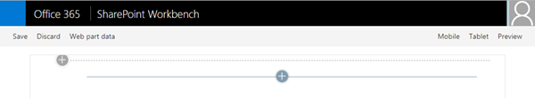
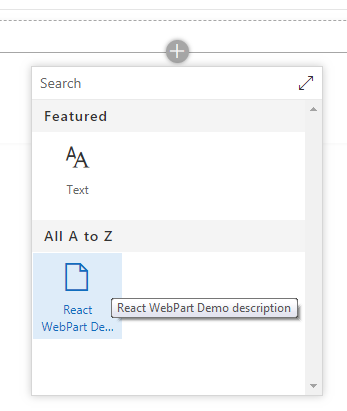
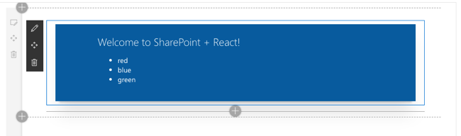
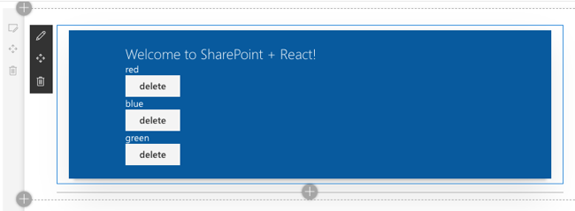
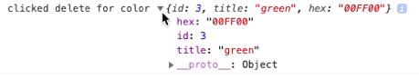
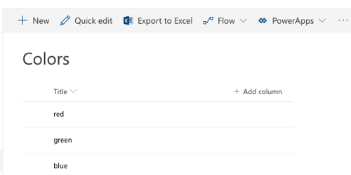

# Using React and Office UI Fabric React Components

In this lab you work with React and the the SharePoint Framework (SPFx) to extend the user interface with the React web framework.

## In this lab

- [Creating React Web Parts](#exercise1)
- [Leveraging Fabric React](#exercise2)
- [Dynamic React Components](#exercise3)

## Prerequisites

To complete this lab, you need the following:

- Office 365 tenancy
  > If you do not have one, you obtain one (for free) by signing up to the [Office 365 Developer Program](https://developer.microsoft.com/office/dev-program).
- Local SharePoint Framework development environment installed and configured
  - Refer to the SharePoint Framework documentation, specifically the **[Getting Started > Set up development environment](https://docs.microsoft.com/sharepoint/dev/spfx/set-up-your-development-environment)** for the most current steps

<a name="exercise1"></a>

## Exercise 1: Creating React Web Parts

In this exercise you will create a SharePoint Framework client-side web part that leverages the React web framework.

1. Open a command prompt and change to the folder where you want to create the project.
1. Run the SharePoint Yeoman generator by executing the following command:

    ```shell
    yo @microsoft/sharepoint
    ```

    Use the following to complete the prompt that is displayed:

    - **What is your solution name?**: ReactWebPartDemo
    - **Which baseline packages do you want to target for your component(s)?**: SharePoint Online only (latest)
    - **Where do you want to place the files?**: Use the current folder
    - **Do you want to allow the tenant admin the choice of being able to deploy the solution to all sites immediately without running any feature deployment or adding apps in sites?**: No
    - **Will the components in the solution require permissions to access web APIs that are unique and not shared with other components in the tenant?**: No
    - **Which type of client-side component to create?**: WebPart
    - **What is your Web part name?**: React WebPart Demo
    - **What is your Web part description?**: React WebPart Demo description
    - **Which framework would you like to use?**: React

    After provisioning the folders required for the project, the generator will install all the dependency packages using NPM.

1. When NPM completes downloading all dependencies, run the project by executing the following command:

    ```shell
    gulp serve
    ```

1. The SharePoint Framework's gulp **serve** task will build the project, start a local web server and launch a browser open to the SharePoint Workbench:

    

1. Select the web part icon button to open the list of available web parts:

    

1. Select the **React WebPart Demo** web part:

    

### Examine the Web Part code

Before modifying the web part code, take a minute to see how this project differs from a SPFx project that does not utilize React.

1. Open the **package.json** file in the root of the project

    Notice the presence of a few extra packages in the `dependencies` section. The `react` & `react-dom` packages contain the core React web framework and the bridge between React & the DOM while `@types/react` & `@types/react-dom` contain the TypeScript type declarations for the libraries.

1. Open the web part in the **./src/webparts/reactWebPartDemo/ReactWebPartDemoWebPart.ts** file.

    Notice the main difference in this web part from one that does not leverage the React Framework is in the `render()` method. Instead of writing HTML out, it first creates a new React component and then uses the `ReactDom.render()` method to render the component into the `div` for the web part.

    The React component that is created is the **ReactWebPartDemo**.

1. Open the React component: **./src/webparts/reactWebPartDemo/components/ReactWebPartDemo.tsx**.

    This file contains a class declaration that extents the base `React.Component` abstract class. It contains a single method, `render()`, that serves the same purpose as the `render()` method in the web part: it renders the control out.

    Because we are using the TypeScript Extended (***.tsx**) language and syntax, well-formed HTML can be directly returned to the caller. The caller is the React web framework.

    This component has a single public property: `description`. This is defined as an interface in the **./src/webparts/reactWebPartDemo/components/IReactWebPartDemoProps.ts** file.

1. Close the browser and stop the local web server by pressing <kbd>CTRL</kbd>+<kbd>C</kbd> in the command prompt.

Now that you understand how a React project is structured, add some data and a child component to the web part.

### Update the web part code

Update the web part to show a list of colors using a child React component.

1. Create a new file in the **./src/webparts/reactWebPartDemo** folder named **IColor.ts**.

    Add the following code to the file. This will act as an interface to our new object type:

    ```ts
    export interface IColor {
      id: number;
      title: string;
    }
    ```

1. Create a new React component that will show a list of colors provided to it as a public property:

    1. Create a new file **ColorList.tsx** in the **./src/webparts/reactWebPartDemo/components**.
    1. Add the following code to the **ColorList.tsx** file. This creates an public interface for the component's public signature and creates the core React component:

        ```ts
        import * as React from 'react';
        import { IColor } from '../IColor';

        export interface IColorListProps {
          colors: IColor[];
        }

        export class ColorList extends React.Component<IColorListProps, {}> {
          public render(): React.ReactElement<IColorListProps> {
            return ();
          }
        }
        ```

    1. Update the `render()` method in the `ColorList` component with the following. This will write out an unordered list of colors that have been provided as a property when the component is added to the page:

        ```tsx
        public render(): React.ReactElement<IColorListProps> {
          return (
            <ul>
              {
                this.props.colors.map(colorItem => (
                  <li>{ colorItem.title }</li>
                ))
              }
            </ul>
          );
        }
        ```

1. With a React component created that will display a list of colors, the next step is to use it. Do this by updating the default React component created by the SPFx Yeoman generator:
    1. Open the **./src/webparts/reactWebPartDemo/components/ReactWebPartDemo.tsx** file.
    1. Add the following `import` statements after the existing `import` statements. These will add references to the new files and objects you previously created:

        ```ts
        import { IColor } from "../IColor";
        import { ColorList, IColorListProps } from "./ColorList";
        ```

    1. Add a new private member to the `ReactWebPartDemo` class that contains a static collection of colors:

        ```ts
        private _colors: IColor[] = [
          { id: 1, title: 'red' },
          { id: 2, title: 'blue' },
          { id: 3, title: 'green' }
        ];
        ```

    1. Next, update the `ReactWebPartDemo`'s `render()` method to use the new React component you previously created. The only important line here is the `<ColorList>` component reference.

        Notice the `colors` public property on the component is bound to the private array of colors you created above:

        ```tsx
        public render(): React.ReactElement<IReactWebPartDemoProps> {
          return (
            <div className={ styles.reactWebPartDemo }>
              <div className={ styles.container }>
                <div className={ styles.row }>
                  <div className={ styles.column }>
                    <span className={ styles.title }>Welcome to SharePoint + React!</span>
                    <ColorList colors={this._colors} />
                  </div>
                </div>
              </div>
            </div>
          );
        }
        ```

1. Test the project:
    1. Start the local web server using the provided gulp **serve** task:

        ```shell
        gulp serve
        ```

    1. The SharePoint Framework's gulp **serve** task will build the project, start a local web server and launch a browser open to the local SharePoint Workbench.

    1. Add the web part to the workbench. Notice our list of three colors is rendered up exactly as we would expect.

        

    1. Close the browser and stop the local web server by pressing <kbd>CTRL</kbd>+<kbd>C</kbd> in the command prompt.

<a name="exercise2"></a>

## Exercise 2: Leveraging Fabric React

In this exercise, you will update the existing React-based SPFx web part to leverage a few controls from the [Fabric React](https://developer.microsoft.com/fabric) controls.

> This project uses the final project from the previous exercise as the starting point. A copy of the final project from the previous exercise can be found in the **./Demos/01-webpart** folder.

1. Update the existing **ColorList** React component to leverage Fabric React controls.
    1. Open the **./src/webparts/reactWebPartDemo/components/ColorList.tsx** file.
    1. Add the following `import` statements to the top of the file. These will enable adding a DefaultButton and List control to the component:

        ```ts
        import { List } from 'office-ui-fabric-react/lib/List';
        import { DefaultButton } from 'office-ui-fabric-react/lib/Button';
        ```

    1. Update the `render()` method within the `ColorList` class to the following code:

        ```tsx
        public render(): React.ReactElement<IColorListProps> {
          return (
            <div>
              <List items={ this.props.colors } 
                    onRenderCell={ this._onRenderListCell } 
              />
            </div>
          );
        }
        ```

    1. Handle the rendering of each item in the list by adding the following method to the `ColorList` class:

        ```tsx
        private _onRenderListCell = (color: IColor, index: number | undefined): JSX.Element => {
          return (
            <div>
              { color.title }<br />
              <DefaultButton text="delete"
                            data={ color.id }
                            onClick={ () => this._onButtonClick(color) }
              />
            </div>
          );
        }
        ```

    1. Next, add an event handler for when the button is selected:

        ```tsx
        private _onButtonClick(color:IColor): void {
          console.log('clicked delete for color', color);
        }
        ```

1. Test the project:
    1. Start the local web server using the provided gulp **serve** task:

        ```shell
        gulp serve
        ```

    1. The SharePoint Framework's gulp **serve** task will build the project, start a local web server and launch a browser open to the local SharePoint Workbench.

    1. Add the web part to the workbench. Notice our list of three colors is rendered up exactly as we would expect.

        

    1. Select the **delete** button for one of the colors & examine the browser's JavaScript console, usually located in the browser's developer tools. You should see a log message displayed each time a button is selected:

        

    1. Close the browser and stop the local web server by pressing <kbd>CTRL</kbd>+<kbd>C</kbd> in the command prompt.

<a name="exercise3"></a>

## Exercise 3: Dynamic React Components

In this exercise, you will update the existing React-based SPFx web part to make it more dynamic by introducing state and data driven from a SharePoint list.

> This project uses the final project from the previous exercise as the starting point. A copy of the final project from the previous exercise can be found in the **./Demos/02-fabricreact** folder.

1. Create a new SharePoint list within an existing SharePoint site collection. In this lab, it is assumed the list is named **Colors** and has a single **Title** field. Populate this list with some colors as shown in the following figure:

    

1. Update the SharePoint Framework web part to provide additional inputs to the React component:
    1. Open the **./src/webparts/reactWebPartDemo/ReactWebPartDemoWebPart.ts** file.
    1. Locate the `render()` method, and update the code that creates an instance of the React element. This code will add two additional properties to the React web part: `spHttpClient` & `currentSiteUrl`.

        ```tsx
        const element: React.ReactElement<IReactWebPartDemoProps > = React.createElement(
          ReactWebPartDemo,
          {
            description: this.properties.description,
            spHttpClient: this.context.spHttpClient,
            currentSiteUrl: this.context.pageContext.web.absoluteUrl
          }
        );
        ```

1. Update the React component's public properties by updating it's interface:
    1. Open the **./src/webparts/reactWebpartDemo/components/IReactWebPartDemoProps.ts**.
    1. Add the following `import` statement to the top of the file:

        ```ts
        import { SPHttpClient } from "@microsoft/sp-http";
        ```

    1. Update the **IReactWebPartDemoProps** interface to add the two new public properties to the component:

        ```ts
        export interface IReactWebPartDemoProps {
          description: string;
          spHttpClient: SPHttpClient;
          currentSiteUrl: string;
        }
        ```

1. Add a new interface to represent the component's state.
    1. Create a new file **IReactWebPartDemoState.ts** in the folder **./src/webparts/reactWebPartDemo/components**.
    1. Add the following code to the file:

        ```ts
        import { IColor } from '../IColor';

        export interface IReactWebPartDemoState {
          colors: IColor[];
        }
        ```

1. Update the **ColorList** React component.
    1. Locate and open the file **./src/webparts/reactWebPartDemo/components/ColorList.tsx**.
    1. Add the following type to the file, after the existing `import` statements. This will define a new callback type that will represent a new event exposed by this component:

        ```ts
        export type RemoveColorCallback = (color: IColor) => void;
        ```

    1. Add a new event as a public property to the component by updating the existing **IColorListProps** interface. Add the following code to the interface:

        ```ts
        onRemoveColor: RemoveColorCallback;
        ```

    1. Locate the existing `_onButtonClick` method. Currently this method just writes to the browser's JavaScript console. Change the contents to raise the new public event, passing in the color that the button represented:

        ```ts
        private _onButtonClick(color:IColor): void {
          this.props.onRemoveColor(color);
        }
        ```

1. Update the **ReactWebPartDemo** React component:
    1. Locate and open the file **./src/webparts/reactWebPartDemo/components/ReactWebPartDemo.tsx**.
    1. Add the following `import` statements to the top of the file:

        ```ts
        import { IReactWebPartDemoState } from './IReactWebPartDemoState';
        import { SPHttpClient, SPHttpClientResponse } from '@microsoft/sp-http';
        ```

    1. Update the React component to define it's state interface.
        1. Locate the class definition for the **ReactWebPartDemo**. Notice the end of the line contains a `{}` as the second parameter for the `React.Component` base class:

            ```ts
            export default class ReactWebPartDemo extends React.Component<IReactWebPartDemoProps, {}> {
            ```

            This second parameter is how you define the interface for the state of the component. Update this to use the new interface you previously created: `IReactWebPartDemoState`.

            ```ts
            export default class ReactWebPartDemo extends React.Component<IReactWebPartDemoProps, IReactWebPartDemoState> {
            ```

    1. Initialize the state of the component by defining a constructor that sets the default component state:

        ```ts
        constructor(props: IReactWebPartDemoProps) {
          super(props);
          this.state = { colors: [] };
        }
        ```

    1. Add the following method ot the **ReactWebPartDemo** class. This will retrieve an array of items from the previously created SharePoint list using the SharePoint REST API:

        ```ts
        private getColorsFromSpList(): Promise<IColor[]> {
          return new Promise<IColor[]>((resolve, reject) => {
            const endpoint: string = `${this.props.currentSiteUrl}/_api/lists/getbytitle('Colors')/items?$select=Id,Title`;
            this.props.spHttpClient.get(endpoint, SPHttpClient.configurations.v1)
              .then((response: SPHttpClientResponse) => {
                return response.json();
              })
              .then((jsonResponse: any) => {
                let spListItemColors: IColor[] = [];
                for (let index = 0; index < jsonResponse.value.length; index++) {
                  spListItemColors.push({
                    id: jsonResponse.value[index].Id,
                    title: jsonResponse.value[index].Title
                  });

                  resolve(spListItemColors);
                }
              });
          });
        }
        ```

    1. Update the React component's lifecycle by retrieving data from the SharePoint list and setting the component's state when the component is loaded on the page. Setting the state will trigger React to re-render the component, displaying the retrieved data.
        1. Add the following method to the **ReactWebPartDemo** class:

            ```ts
            public componentDidMount(): void {
              this.getColorsFromSpList()
                .then((spListItemColors: IColor[]) => {
                  this.setState({ colors: spListItemColors });
                });
            }
            ```

    1. Update the `render()` method in the **ReactWebPartDemo** to do two things: first, change the binding to instead of using the static collection of colors, use the colors from the new state object that is updated by the lifecycle event `componentDidMount()` and then, attach to an event on the custom component created previously. 

        When this event occurs (something you will implement later in this exercise), it will run our handler. Do this by updating the `<ColorList>` control reference in the `render()` method:

        ```tsx
        <ColorList colors={ this.state.colors }
                    onRemoveColor={ this._removeColor }/>
        ```

    1. Add the following method ot the **ReactWebPartDemo** class to implement the event handler. This will create a new collection of colors that include all the original colors, except the one included in the `onRemoveColor` callback:

        ```ts
        private _removeColor = (colorToRemove: IColor): void => {
          const newColors = this.state.colors.filter(color => color != colorToRemove);
          this.setState({ colors: newColors });
        }
        ```

1. Test the project:
    1. Start the local web server using the provided gulp **serve** task:

        ```shell
        gulp serve
        ```

    1. The browser will load the local workbench, but you can not use this for testing because there is no SharePoint context in the local workbench. Instead, navigate to the SharePoint Online site where you created the **Colors** list, and load the hosted workbench at **https://[sharepoint-online-site]/_layouts/workbench.aspx**.

    1. Add the web part to the hosted workbench. Notice our list of three colors is rendered up exactly as we would expect.

        

    1. Select the **delete** button for one of the colors. Notice the color is removed from the list.

        That is because selecting the button raised an event on the **ColorList** component. The **ReactWebPartDemo** component handles this event by removing the color from the existing collection of colors in the current state and then sets this new collection on the state.

        That action triggers React to re-render the component which results in a list of colors missing the one that was removed.

    1. Close the browser and stop the local web server by pressing <kbd>CTRL</kbd>+<kbd>C</kbd> in the command prompt.